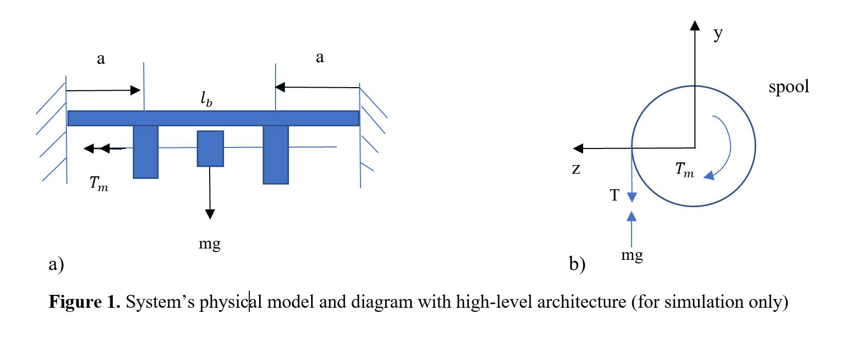

## Controls Project 

##Angular Velocity Control

##MECA 482-03
##Fall 2019

Project Manager : Eduardo Herrera;
Ryan Douglass;
Alfonso Romero ;
Ivan Castillo ;
Cody Anderson; 
William Huegli;

Video link: https://youtu.be/K2sXpFd4kso

##Introduction

For our project we have built a hoist winch with feedback control. This can be useful if a steady angular velocity from the winch is desired. As more load is applied, more voltage is required to maintain the angular velocity of the winch.

Figure 1 illustrates the physical system in top view and side view. The system consists of a main support beam, two support bearings and a shaft, and the spool. Torque is applied to the shaft and spool from a motor and the angular velocity is monitored by a tachometer.

The load of the system can be modeled through the use of Newton’s laws.

x2

g = gravity positive direction is down
M load = mass of the load
Msh, Rsk = mass and radius of the motor shaft
Msp, rsp = mass and radius of the spool
Alpha = rotational acceleration

##Control Theory Modeling

x3

Figure 3: DC motor system where applied voltage is input and the output is current, torque, and speed.

Steady state speed of the motor with a constant voltage applied is:

KM = motor gain
V   = applied input voltage
R   = resistance
TL  = applied load
KV = input gain
B   = friction

Steady-state torque of the motor with a constant voltage applied is shown to be:

Figure 4: The proportional relationship of motor torque to motor speed with an increasing applied voltage.

Transfer functions of the system must be developed in order to compute the frequency response in MATLAB. A time signal V(t) may have a Laplace Transform of:
 
Transfer function relates the output response to the input response. With an input of u(t) and an output y(t), H(s) is the transfer function in the s-domain that relates the ratio of output to input.

The system for controlling the angular velocity of the motor shaft requires that multiple transfer functions be used. The transfer functions may be combined into an equivalent transfer function. For the DC motor control we have:

Combining the equations into the system model yields:

Figure 5 - Feedback
		
V = Reference signal
VB = Feedback signal
V-VB = Error
I = Current
1/(sL+R) = Electrical sub-system transfer function
1/(sJ+B) = Mechanical sub-system transfer function

Finding the transfer function relating input voltage to motor speed:

Setting s = 0 yields the steady-state response of motor speed:

##Tachometer(Kt)

The tachometer can be modeled as a Derivative controller:

 

angular
displacement = θ(t)

Therefore:
angular speed = w(t) = θ(t)

The Induced emf is proportional to angular speed e(t) ∝ w(t)

e(t) = K

Here K is a proportional constant: 

e(t) =, 

Apply Laplace transform function on both
sides:

E(S) = KS * θ(S)

Therefore, 
H =  = KS 

Controller Design and Simulation

Step Response (see appendix for full code)

Given the following specs from the motor, a state space model using matlab models the step response of the system without a load disturbance. The graphical representation of the modeled system verifies the calculated transfer functions derived in EQ.1 (Figure 6). 
R = 2.0;      % Ohms
L = 0.5;      % Henrys
Km = 0.1;     % torque constant
Kb = 0.1;     % back emf constant 
kf = 0.2;     % Nms
J = 0.02;     % kg.m^2/s^2 (Newton N)

Root Locus:

Next, a torque disturbance Td  is introduced and a gain value for integral control (K/s) is found using root locus plotting in matlab. A value of K=5 can be determined as it falls within the results range (Figure 7).  

Disturbance Rejection:
K value can be then used in the system and modeled with Td. The system now can react and correct a slowing down of the angular velocity of the motors output due to disturbances. The torque disturbance is applied and the integrative controller reacts with a correction in motor input voltage to increase motor speed and torque (Figure 4). When load is released the Controller adjusts the motor input voltage once again. 

Improvements:
A P controller can be added to help with a faster response time, and adjusting the integral gain to deal with the P controller’s overshoot and oscillations. A PI controller would make the response faster and smoother. 

Hazards:
	Integral windup should be avoided by applying Controller output limits. As Integral error can continue to rise in situations of saturation causing a run away effect. Another way to fight this is to incorporate a derivative controller. But, that can cause other problems and be less cost effective than implementing controller output limits.  

Implementation:
The above matlab models are modeled using the back emf as the feedback signal however, in a real system we would want to control a feedback signal from a device such as a tachometer for better precision. Due to time constraints, a matlab model including the tachometer feedback was not able to be made using matlab.

##Appendix A
Matlab Code:
% MECA 482
% Anglular Velocity Control with Feedback of DC Motor

clear all, close all, close all
clc

R = 2.0;      % Ohms
L = 0.5;      % Henrys
Km = 0.1;     % torque constant
Kb = 0.1;     % back emf constant
Kf = 0.20;    % friction; Nms
J = 0.02;     % kg.m^2/s^2 (Newton N)

% State Space Representation model of DC motor
% two inputs, (Va, Td) and one output (w)
% variables:
% Va- applied voltage
% Td- torque disturbance
%w- angular velocity

h1 = tf(Km,[L R]);            % electrical sub-system tf
h2 = tf(1,[J Kf]);            % mechanical sub-system tf

dcm = ss(h2) * [h1 , 1];      % motor ss response; w = h2 * (h1*Va + Td)

% Plot of angular velocity response to change in voltage Va
figure(1)
stepplot(dcm(1));

% Feedback control
% enforce steady state error, use integral control
% of the form C(s)=K/s, where K is to be determined

% Root Locus Method for Finding K
figure(2)
sys = (tf(1,[1 0]) * dcm(1));   % system tf
rlocus(sys)                     % root locus plot

xlim([-12 1]);                  % plot resolution in x-direction
ylim([-2 2]);                   % plot reloultion in y-direction
zeta = 0.7;                     % desired damping ratio
wn = 1.8;                       % natural frequency
sgrid(zeta,wn)                  % display zeta and wn
[k,poles] = rlocfind(sys)       % finding K on plot

t = 0:0.1:15;                   % time range
Td = -0.1 * (t>5 & t<10);       % load disturbance
u = [ones(size(t)) ; Td];       % w_ref=1 and Td

Kb = 5;                         % back emf
C  = tf(Kb,[1 0])               % compensator K/s

K = 5.6;                        % gain for critically damped
sys_cl = feedback(K*sys,1)      % state space representation

figure(4)
cl_rloc = feedback(dcm * append(C,1),1,1,1);
sys = lsimplot(cl_rloc,u,t);
title('Control feedback with Disturbance Rejection')
legend('feedback w/ rlocus','Location','NorthWest')

Select a point in the graphics window
selected_point =
  -1.5938 + 1.6447i

k =
    5.7177

poles =
 -10.7819 + 0.0000i
  -1.6090 + 1.6474i
  -1.6090 - 1.6474i

C =
 
  5
  -
  s
 
Continuous-time transfer function.

State-Space Representation
sys_cl =
 
  A = 
         x1    x2    x3
   x1     0  6.25     0
   x2     0   -10   3.2
   x3  -2.8     0    -4
 
  B = 
        u1
   x1    0
   x2    0
   x3  0.5
 
  C = 
        x1   x2   x3
   y1  5.6    0    0
 
  D = 
       u1
   y1   0

Continuous-time state-space model.
 
##References

Mathworks, C. (2019). DC motor control. Retrieved from https://www.mathworks.com/help/control/examples/dc-motor-control.html

Mathworks, C. (2019). SISO example: the DC motor. Retrieved from https://www.mathworks.com/help/control/getstart/linear-lti-models.html

University of Michigan. (2008). Motor Control [PDF document]. Retrieved from http://web.eecs.umich.edu/~jfr/embeddedctrls/files/Lecture6.pdf

University of Michigan, Carnegie Mellon University, University of Detroit Mercy. (n.d.). Introduction: root locus controller design. Retrieved from http://ctms.engin.umich.edu/CTMS/index.php?example=Introduction&section=ControlRootLocus

